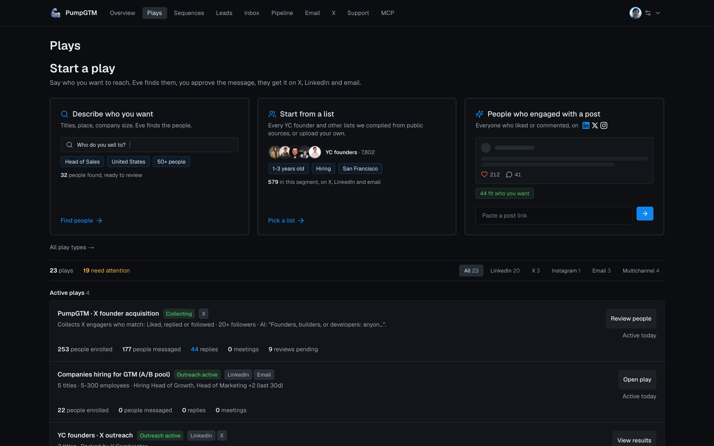
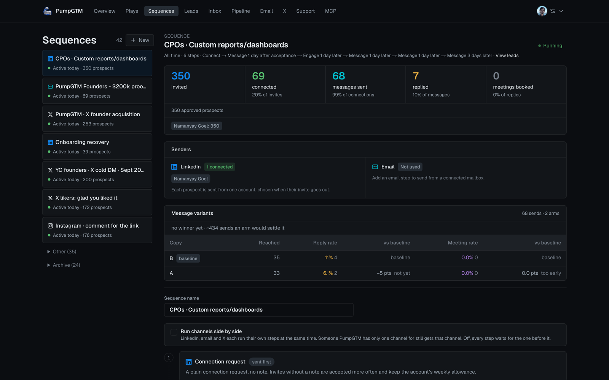
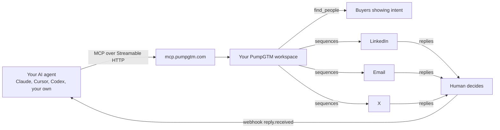

<p align="center"><a href="https://pumpgtm.com"></a></p>

<h1 align="center">PumpGTM MCP server</h1>

<p align="center"><b>Run LinkedIn, email and X outreach from any AI agent.</b><br>
PumpGTM finds the buyers showing intent this week, drafts and sends the outreach from your own accounts inside each platform's limits, and hands every reply back to a human. This is the public reference for the hosted MCP server at <code>https://mcp.pumpgtm.com/mcp</code>.</p>

<p align="center">
<a href="https://pumpgtm.com/docs/mcp"></a>
<a href="https://modelcontextprotocol.io"></a>
<a href="tools.json"></a>
<a href="https://github.com/pumpgtm/pumpgtm-api"></a>
<a href="https://pumpgtm.com/yc"></a>
<a href="https://pumpgtm.com/blog/ai-founder-led-outbound-system"></a>
<a href="LICENSE"></a>
</p>

<p align="center">
<a href="https://pumpgtm.com/docs/quickstart">Quickstart</a> · <a href="https://pumpgtm.com/docs/mcp">Docs</a> · <a href="tools.json">tools.json</a> · <a href="https://github.com/pumpgtm/pumpgtm-api">REST API</a> · <a href="https://pumpgtm.com/mcp/platforms">Platforms and agencies</a> · <a href="https://www.youtube.com/@pumpgtm">YouTube</a>
</p>

## What your agent is driving

The same workspace the dashboard shows. Plays find people, sequences reach them across LinkedIn, email and X, and every reply waits for a human.

<p align="center"></p>
<p align="center"></p>

## How it fits together



## Watch and read

<table>
<tr>
<td width="50%" align="center"><a href="https://pumpgtm.com/blog/what-is-pumpgtm-how-it-works"></a><br><sub><b>What is PumpGTM, and how does it actually work?</b><br>4 minute walkthrough</sub></td>
<td width="50%" align="center"><a href="https://x.com/NamanyayG/article/2097783972302557668"></a><br><sub><b>Using AI to run founder-led outbound for 10 YC companies</b><br>Namanyay's article on X: one lead universe, shared prospects, copy measured by meetings. <a href="https://pumpgtm.com/blog/ai-founder-led-outbound-system">Read on pumpgtm.com</a></sub></td>
</tr>
</table>

More on the [PumpGTM YouTube channel](https://www.youtube.com/@pumpgtm) and in [PumpGTM in the wild](https://pumpgtm.com/customers/videos), videos founders and creators made on their own channels.

## Connect

Endpoint (Streamable HTTP): `https://mcp.pumpgtm.com/mcp`

Two ways to authenticate, both scoped to one workspace:

- **OAuth 2.1** for Claude (web and desktop) and ChatGPT. Add the endpoint as a connector and sign in. Dynamic client registration and PKCE are supported; metadata is at `https://pumpgtm.com/.well-known/oauth-authorization-server`. Access tokens last 30 days, refresh tokens 90.
- **Workspace key** for Claude Code, Cursor, Codex, the MCP SDKs, or your own agent. Sign in at [app.pumpgtm.com](https://app.pumpgtm.com), open **MCP** in the left nav, and copy the key. Send it as `Authorization: Bearer eve_mcp_..` on every request. The key does not expire. Rotation is not self-serve yet: write to hello@pumpgtm.com and we rotate it for you.

The key's database row fixes the workspace. It cannot read or act on any other workspace.

```ts
import { Client } from "@modelcontextprotocol/sdk/client/index.js";
import { StreamableHTTPClientTransport } from "@modelcontextprotocol/sdk/client/streamableHttp.js";

const client = new Client({ name: "your-agent", version: "1.0.0" });
await client.connect(
  new StreamableHTTPClientTransport(new URL("https://mcp.pumpgtm.com/mcp"), {
    requestInit: { headers: { Authorization: `Bearer ${process.env.PUMPGTM_KEY}` } },
  }),
);
const { tools } = await client.listTools(); // 24 tools, listed below
```

Codex: `codex mcp add pumpgtm --url https://mcp.pumpgtm.com/mcp` then `codex mcp login pumpgtm`. Claude Code: `claude mcp add --transport http pumpgtm https://mcp.pumpgtm.com/mcp --header "Authorization: Bearer eve_mcp_.."`.

## How results come back

- Every tool result is one MCP `content` block of type `text` whose `text` is a JSON string, and the same object in `structuredContent`. Parse the JSON.
- Most results include `next`: `{ tool, arguments, reason, requiresConfirmation, requiresNewRequestId? }`. It is the suggested following call, not an instruction to skip the customer.
- Errors return `isError: true` and `{ status, retryable, changed, message, details }`. `changed: false` means nothing was written. A missing object returns code `resource_not_found`.
- Tools that write take a `requestId`: 8 to 120 characters of letters, digits, `. _ : -`, starting with a letter or digit. It is an idempotency key. Use a fresh one per call; reuse one only to retry the same call.
- Metered workspaces carry Energy: one Energy is one person found. `get_workspace` returns `energy` with the monthly allowance, used and remaining, and `find_people` refuses with `energy_exhausted` when a run would exceed it. Workspaces without Energy see no such field. See [Energy](https://pumpgtm.com/docs/api#energy).
- Nothing reaches LinkedIn, email or X until a person approves it. `find_people`, `review_people`, `save_sequence_draft` and `add_leads` never send. Sending starts with `set_sequence_status` `active` on an approved sequence, and each reply is answered only through `decide_reply`.

## A complete flow

1. `get_workspace` to read setup state, sequences, unfinished reviews and pending replies.
2. `find_people` with `targeting` and `confirmed: false` to save a Play and show the targeting summary. Then `find_people` with `playId` and `confirmed: true` to run it.
3. `review_people` with `decisions` and `finish: true` to queue the good fits into a sequence.
4. `save_sequence_draft` with steps, then `set_sequence_status` `approved` with `expectedRevision`, then `active`.
5. `list_pending_replies`, show the draft to the customer, `decide_reply`.

Reporting: `get_workspace` (`view: "summary"` for the funnel and account pacing, `view: "activity"` for the ledger) and `list_leads` with `stage` or `sinceDays`. The same numbers are available over REST at [/docs/api](https://pumpgtm.com/docs/api).

## Resources and prompts

`resources/list` returns six lead-search guides: `gigacatalyst://lead-search/catalog`, `quickstart`, `fields`, `query-builder`, `patterns` and `results`. Read `fields` before writing `targeting` by hand. One prompt, `gigacatalyst_find_people`, takes `requestedCount` ("10" to "100").

## Versioning

Tools scheduled for removal say so in their description for at least 90 days before leaving `tools/list`. There is no fixed rate limit on the MCP server today; discovery is paced by each workspace's daily provider budget.

<details>
<summary><b>Tool reference: all 24 tools, arguments and modes</b> (generated from the live <code>tools/list</code>)</summary>

## Tool reference

Generated from the live `tools/list` on 2026-09-23. "Read only" tools never write. Feature-gated groups return a structured error on workspaces without that feature.

### Start here

#### get_workspace (read only)

Start here. Summary: setup state (LinkedIn, billing, finish-setup link), LinkedIn progress, Plays, eligible sequences, unfinished review, pending replies count, and (when the workspace has the email channel) its mailboxes and email campaigns. view=activity reads the append-only LinkedIn activity ledger with filters. view=x_posts lists the connected X account's recent posts with like counts and which sequence, if any, already DMs each post's likers (workspaces with the X channel).

| Argument | Type | Notes |
|---|---|---|
| `view` | `summary`, `activity`, `x_posts` | default `"summary"`.  |
| `sinceDays` | integer | default `7`, range 0 to 365.  |
| `account` | string |  |
| `actions` | array of `resolve`, `invite`, `accepted`, `like`, `message`, `followup`, `reply_detected`, `view_profile`, `endorse`, `comment`, `tool_prepare`, `enrich`, `meeting_invited`, `reply_drafted`, `reply_sent`, `reply_dismissed`, `reply_snoozed`, `sequence_started`, `meeting_booked`, `meeting_no_show`, `meeting_synced`, `manual_override`, `x_dm`, `x_follow`, `x_like`, `x_follow_back`, `x_follow_back_scan`, `x_credit_balance`, `x_reply_subscription`, `instagram_dm`, `instagram_comment`, `track_unavailable`, `track_done`, `ad_campaign_architected`, `ad_campaign_saved`, `ad_creative_generated`, `ad_budget_revised`, `ad_approval_requested`, `ad_campaign_approved`, `ad_campaign_published_paused`, `linkedin_search`, `web_pages_read`, `email_found`, `email_campaign_created`, `email_campaign_added`, `email_sent`, `email_replied`, `email_skipped`, `email_bounced`, `email_unsubscribed`, `email_click`, `sequence_people_added`, `lead_replenishment_enabled`, `lead_replenishment_disabled`, `recovery_eligible`, `recovery_matched`, `recovery_enrolled`, `recovery_review`, `recovery_invite_sent`, `recovery_invite_accepted`, `recovery_message_sent`, `recovery_reply_detected`, `recovery_suppressed`, `engine_run`, `linkedin_connect`, `error` |  |
| `outcome` | `ok`, `failed`, `skipped` |  |
| `limit` | integer | default `100`, range 1 to 500.  |

### Find and review people

#### find_people

Create or revise a Play from targeting and run it. Targeting may include a hiring signal (currentCompanyHiringRolesAny): the person's current company must have an open job posting for one of those roles, posted within currentCompanyHiringPostedWithinDays. Without confirmed=true it only saves the Play and returns the targeting summary for the customer to confirm. An unresolved required company is preserved in the saved draft and returned under companyResolution; the Play cannot run until the customer corrects or explicitly removes it in a revision. With confirmed=true, a ready Play runs discovery and returns candidates in retrieval order. Pass playId alone to rerun an existing ready Play. Optional sequenceId sets the Play's default sequence. Creates no leads and contacts no one.

| Argument | Type | Notes |
|---|---|---|
| `requestId` | string | required. Stable idempotency key; reuse it only to retry this exact request. |
| `targeting` | object |  |
| `playId` | uuid |  |
| `expectedRevision` | integer | range  to 9007199254740991. Required with targeting when revising an existing playId. |
| `confirmed` | boolean | default `false`.  |
| `sequenceId` | uuid |  |

#### review_people

Without decisions: read one review batch with its candidates and saved choices. With decisions: record the customer's explicit good_fit and not_a_fit choices; a top-level sequenceId applies to every good fit, finish=true completes the review and queues good fits into the sequence. For add all, mark every candidate good_fit with finish=true. Sends nothing in this call.

| Argument | Type | Notes |
|---|---|---|
| `batchId` | uuid | required.  |
| `requestId` | string | Required with decisions. |
| `sequenceId` | uuid |  |
| `decisions` | array of objects |  |
| `finish` | boolean | default `false`.  |

#### search_known_people (read only)

Search a company, professional role, or explicitly stated accelerator cohort in permitted shared professional evidence. Returns at most 20 matching identities; coverage is incomplete and includes labelled historical roles and interpretations. This is not a live provider search, does not expose other customers' lists or messages, and does not authorize outreach. Check source dates before recommending someone.

| Argument | Type | Notes |
|---|---|---|
| `query` | string | required.  |

#### get_lead_profile (read only)

Read source-dated public identities, available employment history, public activity and relationship observations for a lead owned by this workspace. Public profile links and AI interpretations require review. This does not fetch providers, change identities, enroll or contact anyone.

| Argument | Type | Notes |
|---|---|---|
| `leadId` | uuid | required.  |

### Sequences

#### list_sequences (read only)

Sequences with steps, approval state, status, and exact enrolled-lead counts. Pass sequenceId to read one sequence with its exact revision before editing.

| Argument | Type | Notes |
|---|---|---|
| `sequenceId` | uuid |  |

#### save_sequence_draft

Without sequenceId: create a complete new sequence (name plus ordered steps). With sequenceId and expectedRevision: replace a draft's complete step list; move active or paused sequences to draft first. Steps are connect, message, engage (LinkedIn), email (subject plus body; only when the workspace has email enabled), or x_dm (an X direct message to a post liker; an X sequence is x_dm steps only, for workspaces with the X channel). When any LinkedIn step is present step 0 must be connect; an email-only sequence needs no connect. delayDays counts from the previous step (the step after connect waits for the invite to be accepted) and later steps are skipped once the person replies on any channel. {{firstName}} {{fullName}} {{company}} {{title}} render on both channels. Example mixed flow: connect, message +1d, email +2d, email +2d, email +3d. The result stays a stopped draft that needs approval, then activation, through set_sequence_status.

| Argument | Type | Notes |
|---|---|---|
| `requestId` | string | required. Stable idempotency key; reuse it only to retry this exact request. |
| `sequenceId` | uuid |  |
| `expectedRevision` | integer | range  to 9007199254740991.  |
| `name` | string |  |
| `steps` | array of objects | required.  |
| `executionModel` | `linear`, `tracks` | tracks: LinkedIn, email and X steps run as parallel lanes per person (each lane's delayDays count from its own previous step; a person without one channel's handle still gets the others). Needs the workspace's multichannel_tracks feature. D |

#### set_sequence_status

For a LinkedIn sequence (sequenceId): status=approved records the customer's approval of one exact draft revision (expectedRevision required) and keeps it stopped; active starts outreach for an approved sequence, paused stops it for every enrolled lead, draft reopens it for editing. For an email campaign (emailCampaignId): active launches sending inside its schedule and limits, paused stops it, draft reopens it; approved does not apply. Each is a separate explicit customer decision.

| Argument | Type | Notes |
|---|---|---|
| `sequenceId` | uuid |  |
| `emailCampaignId` | uuid |  |
| `status` | `approved`, `active`, `paused`, `draft` | required.  |
| `expectedRevision` | integer | range  to 9007199254740991.  |

### Leads

#### list_leads (read only)

This workspace's leads with LinkedIn and sequence progress. stage is cumulative (reached this milestone or beyond); stageExact is the current position only. Count is exact even when the page is limited. Pass leadId to read one lead in full.

| Argument | Type | Notes |
|---|---|---|
| `leadId` | uuid |  |
| `stage` | `queued`, `resolving`, `invited`, `accepted`, `messaged`, `followed_up`, `replied`, `failed`, `skipped` |  |
| `stageExact` | `queued`, `resolving`, `invited`, `accepted`, `messaged`, `followed_up`, `replied`, `failed`, `skipped` |  |
| `sequenceId` | uuid |  |
| `strategyId` | uuid |  |
| `query` | string |  |
| `engagedOnly` | boolean |  |
| `bookedOnly` | boolean |  |
| `sinceDays` | integer | range 0 to 365.  |
| `limit` | integer | range 1 to 500.  |

#### add_leads

Queue leads into one approved active sequence: 1 to 500 manual LinkedIn profiles, CSV content, or a saved Sales Navigator list URL. Manual and CSV finish immediately and return added, duplicate, and invalid counts plus stable addedLeadIds. Sales Navigator runs in the background and auto-enrolls; use method=import_status with its batchId to check. Nothing is sent in this call.

The input is one of these shapes:

- `method: "manual"` with `requestId` (required), `sequenceId` (required), `leads` (required)
- `method: "csv"` with `requestId` (required), `sequenceId` (required), `csvContent` (required)
- `method: "sales_navigator"` with `requestId` (required), `sequenceId` (required), `accountId`, `listUrl` (required)
- `method: "import_status"` with `batchId` (required)

#### remove_leads

Only when the customer explicitly asks to undo an add or stop leads. Target lead IDs or one batchId from add_leads. Uncontacted leads leave the queue; contacted leads keep history and get no further automated steps. Sent invitations and messages cannot be reversed.

The input is one of these shapes:

- `target: "leads"` with `leadIds` (required)
- `target: "import"` with `batchId` (required)

### Replies

#### list_pending_replies (read only)

Inbound LinkedIn replies frozen for human review, each with PumpGTM's draft answer. Read-only.

| Argument | Type | Notes |
|---|---|---|
| `limit` | integer | default `50`, range 1 to 200.  |

#### decide_reply

Apply one explicit human decision to a pending reply. send, invite, and booking_link contact the prospect; opt_out is permanent. Show the draft and ask the customer first.

| Argument | Type | Notes |
|---|---|---|
| `draftId` | uuid | required.  |
| `decision` | `send`, `invite`, `booking_link`, `snooze`, `start_sequence`, `meeting_booked`, `dismiss`, `opt_out` | required.  |
| `text` | string |  |
| `days` | integer | range 1 to 365.  |
| `decidedBy` | string | default `"mcp"`.  |

### Post engagers and X (X tools need the X channel)

#### reach_post_engagers

LinkedIn post URL plus message: PumpGTM creates a Play with its own approved sequence (note-less connection request, then your message), fetches every reactor and commenter in the background (up to 500), and enrolls all of them; call again with only playId for progress. X post URL (x.com/…/status/…) plus message, or plus an existing X sequenceId: its likers and repliers are collected into Lead Universe for review as they engage, from now on; the customer adds the ones they want to that X sequence there (or with add_to_sequence). followers=true instead of a post URL does the same for the account's new followers (workspaces with the X channel; call again with only watchId for people waiting for review, DMs sent, replies). Nothing is enrolled or sent in this call.

| Argument | Type | Notes |
|---|---|---|
| `postUrl` | uri |  |
| `followers` | boolean | X only: collect the account's new followers for review instead of a post's engagers. |
| `message` | string |  |
| `sequenceId` | uuid | X posts only: an existing X DM sequence instead of a new one from message. |
| `name` | string |  |
| `playId` | uuid |  |
| `watchId` | uuid |  |

#### x_account

One action from a connected X account: follow a person (target is an X profile URL or @handle), or like or repost one post (target is an X post URL). `as` picks which connected account acts when the workspace has several (get_workspace view=x_posts lists them); default is the first connected. Needs the X channel. It never sends a DM or writes a new post.

| Argument | Type | Notes |
|---|---|---|
| `action` | `follow`, `like`, `repost` | required.  |
| `target` | string | required.  |
| `as` | string |  |

### Account universe (needs the account universe feature)

#### research_competitor

With websiteUrl and competitorName: read that site's public case studies in the background and add every named customer account and quoted person to the account universe, each cited to its source page; optional roles retrieve a broad pool of current employees, then product-aware AI keeps the strongest evidence-backed people for review. Supply productBrief when the Play promotes a different product or the workspace has no confirmed profile. Without websiteUrl and competitorName: list the sourced account universe (optional playId narrows to one competitor and reports research status). Review material only; enrolls and contacts no one.

| Argument | Type | Notes |
|---|---|---|
| `websiteUrl` | uri |  |
| `competitorName` | string |  |
| `roles` | array of string |  |
| `productBrief` | string |  |
| `maxCaseStudies` | integer | range 1 to 80.  |
| `maxPeopleTotal` | integer | default `100`, range 1 to 500.  |
| `playId` | uuid |  |
| `limit` | integer | default `200`, range 1 to 500.  |

#### reach_universe

Pick people from the account universe (by competitor name, playId, or exact candidateIds; notYetEnrolled skips anyone already in LinkedIn outreach) and reach them on one channel. channel=email puts everyone with a known email into one of the workspace's own email campaigns, either campaignId or a new draft named campaignName, and may set the campaign's steps (plain text, {{firstName}} {{company}} {{title}} placeholders, delayDays between steps), schedule, sending mailboxIds (or allMailboxes), and dailyLimit in the same call; people without an email are skipped, and findEmails=true first looks up missing addresses, up to maxEmailLookups and a daily limit. channel=linkedin enrolls them into an active approved sequence by sequenceId through the ordinary paced engine. Nothing is launched or sent in this call.

| Argument | Type | Notes |
|---|---|---|
| `channel` | `email`, `linkedin` | required.  |
| `competitor` | string |  |
| `playId` | uuid |  |
| `candidateIds` | array of uuid |  |
| `notYetEnrolled` | boolean | default `true`.  |
| `campaignId` | string |  |
| `campaignName` | string |  |
| `findEmails` | boolean | default `false`.  |
| `maxEmailLookups` | integer | default `50`, range 1 to 200.  |
| `steps` | array of objects |  |
| `schedule` | object |  |
| `mailboxIds` | array of uuid |  |
| `allMailboxes` | boolean | default `false`.  |
| `dailyLimit` | integer | range 1 to 5000.  |
| `sequenceId` | uuid |  |

#### add_to_sequence

Pick people from the account universe (by competitor name, playId, or exact candidateIds; notYetEnrolled skips anyone already in a sequence) and add them to one sequence: an existing non-archived sequenceId from list_sequences, or a new draft named name built from template linkedin / email / linkedin_email (then edit its steps with save_sequence_draft). Email-only sequences skip people without a known email; mixed sequences keep them and their email steps wait until an address is known; findEmails=true first looks up missing addresses, metered. Adding never approves, launches, or sends: the customer approves and starts the sequence with set_sequence_status.

| Argument | Type | Notes |
|---|---|---|
| `competitor` | string |  |
| `playId` | uuid |  |
| `candidateIds` | array of uuid |  |
| `notYetEnrolled` | boolean | default `true`.  |
| `sequenceId` | uuid |  |
| `name` | string |  |
| `template` | `linkedin`, `email`, `linkedin_email`, `linkedin_email_parallel` |  |
| `findEmails` | boolean | default `false`.  |
| `maxEmailLookups` | integer | default `50`, range 1 to 200.  |

### CRM (needs the CRM feature)

#### get_pipeline (read only)

Read your workspace's CRM opportunities and company lifecycle. Money is in minor units and totals are separated by currency. Probabilities are explicit stage/team estimates, not calibrated predictions or verified revenue. Requires the CRM feature.

| Argument | Type | Notes |
|---|---|---|
| `q` | string |  |
| `currency` | string |  |
| `attention` | boolean |  |
| `scope` | `active`, `archived`, `all` | default `"active"`. Active excludes archived companies; archived and all preserve historical access. |
| `offset` | integer | default `0`, range 0 to 10000.  |
| `limit` | integer | default `50`, range 1 to 100.  |

#### get_company (read only)

Company, linked lead contacts, opportunities, success plan, and latest 100 source-attributed events. Recorded/imported signals do not imply a live provider connection.

| Argument | Type | Notes |
|---|---|---|
| `company_id` | uuid | required.  |

#### save_company

Create or revise a CRM company and its customer success plan. Use a new UUID and expected_revision=0 to create; use the current revision to edit. Lifecycle is your team's assessment; active never means Stripe-verified. Do not invent customer status. Does not send, enroll, or bill anyone.

| Argument | Type | Notes |
|---|---|---|
| `id` | uuid | required.  |
| `expected_revision` | integer | required, range 0 to 9007199254740991.  |
| `name` | string | required.  |
| `domain` | string | required.  |
| `lifecycle` | `prospect`, `onboarding`, `active`, `at_risk`, `churned` | required.  |
| `owner` | string | required.  |
| `success_plan` | string | required.  |
| `next_review_on` | date | required.  |

#### save_opportunity

Create or revise a deal for an existing CRM company. Ask for missing value/currency; null value means unknown. Use a new UUID/revision=0 to create, otherwise current revision. Stage does not change outreach or company lifecycle. Won means recorded won, not paid. Only set probability_override when the user supplies an estimate.

| Argument | Type | Notes |
|---|---|---|
| `id` | uuid | required.  |
| `expected_revision` | integer | required, range 0 to 9007199254740991.  |
| `company_id` | uuid | required.  |
| `title` | string | required.  |
| `stage` | `new`, `qualified`, `meeting`, `proposal`, `negotiation`, `won`, `lost` | required.  |
| `amount_minor` | integer | required.  |
| `currency` | `USD`, `EUR`, `GBP`, `CAD`, `AUD`, `INR` | required.  |
| `probability_override` | integer | required.  |
| `expected_close_on` | date | required.  |
| `next_step` | string | required.  |
| `next_step_due_on` | date | required.  |

#### add_company_contact

Add a company contact, optionally linked to an existing PumpGTM lead in this workspace. Never guess a lead match from a company name. Does not create or enroll outreach leads.

| Argument | Type | Notes |
|---|---|---|
| `id` | uuid | required.  |
| `company_id` | uuid | required.  |
| `name` | string | required.  |
| `email` | email | required.  |
| `role` | string | required.  |
| `lead_id` | uuid | required.  |

#### record_customer_signal

Append a dated note, meeting, reply, product engagement, risk, or milestone, with its source link. Use evidence, not assumptions. Source names are attribution, not provider verification. Does not read a provider or send to Slack. A note never refreshes contact recency.

| Argument | Type | Notes |
|---|---|---|
| `id` | uuid | required.  |
| `company_id` | uuid | required.  |
| `kind` | `note`, `meeting`, `reply`, `product_engagement`, `risk`, `milestone` | required.  |
| `source` | `manual`, `eve`, `notion`, `fathom`, `granola`, `calendar`, `slack`, `stripe` | required.  |
| `title` | string | required.  |
| `body` | string | required.  |
| `occurred_at` | date-time | required.  |
| `source_url` | uri | required.  |


</details>

## Not on this server yet

- Managing several client workspaces from one connection. Today one key is one workspace. The agency layer is in progress; write to hello@pumpgtm.com.
- Webhooks are managed over REST, not MCP: `POST /api/v1/webhooks` with the same key, see [/docs/api](https://pumpgtm.com/docs/api).

Questions: hello@pumpgtm.com.


## Guides and reading

| If you want to | Read |
|---|---|
| Understand the closed loop behind the tools | [AI GTM engine: the system we run for YC startups](https://pumpgtm.com/blog/ai-gtm-engine-closed-loop-system) |
| Book meetings from LinkedIn at scale | [LinkedIn outbound playbook: 30+ enterprise meetings a week](https://pumpgtm.com/blog/linkedin-outbound-playbook-enterprise-meetings) |
| Write the first message | [A cold message that gets replies: 3 rules from 10+ YC startups](https://pumpgtm.com/blog/cold-message-that-gets-replies-three-rules) |
| Compare MCP-capable outreach tools | [LinkedIn outreach tools with an MCP server (2026)](https://pumpgtm.com/best/linkedin-outreach-tools-with-mcp-server) |
| Score leads before you reach out | [LinkedIn lead scoring: filter leads before outreach](https://pumpgtm.com/blog/linkedin-lead-scoring-before-outreach) |
| See a customer result | [How PumpGTM helped Supermemory find customers](https://pumpgtm.com/blog/how-pumpgtm-helped-supermemory-find-customers) |
| Give many users or clients their own workspace | [PumpGTM for platforms and agencies](https://pumpgtm.com/mcp/platforms) |
| Hand an agent everything at once | [pumpgtm.com/llms.txt](https://pumpgtm.com/llms.txt) |

---

<p align="center">
<a href="https://pumpgtm.com">pumpgtm.com</a> · <a href="https://pumpgtm.com/docs">Docs</a> · <a href="https://app.pumpgtm.com/onboarding">Start a workspace</a> · <a href="https://x.com/pumpgtm">X</a> · <a href="https://www.youtube.com/@pumpgtm">YouTube</a> · <a href="mailto:hello@pumpgtm.com">hello@pumpgtm.com</a><br>
<sub>Built by <a href="https://pumpgtm.com/about">Giga Next Inc.</a>, San Francisco. Documentation and schemas in this repository are MIT licensed; the hosted service is a commercial product.</sub>
</p>
